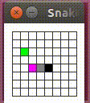

## Snake AI Player

An AI snake game in Java.

Use Eclipse to open the project and run the game.

## Demo

## Keyboard Control

| Key | Feature |
|:---:|---------|
|Up|move up|
|Left|move left|
|Down|move down|
|Right|move right|
|Enter|resume the snake|
|Esc|pause the snake|
|R|Restart the game|
|O|Turn on/off AI|

## Some problems:

| # | Problem |
|:-:|---------|
| 1 |The findLongestPath () function is not optimum to find a good path to traversal as many as space as possible to reach the target. This will cause possible collision for the snake.|
| 2 |Sometimes the new food is generated around snake's head at the later game. It will give snake no chance to calculate the route and collide to its body.|
